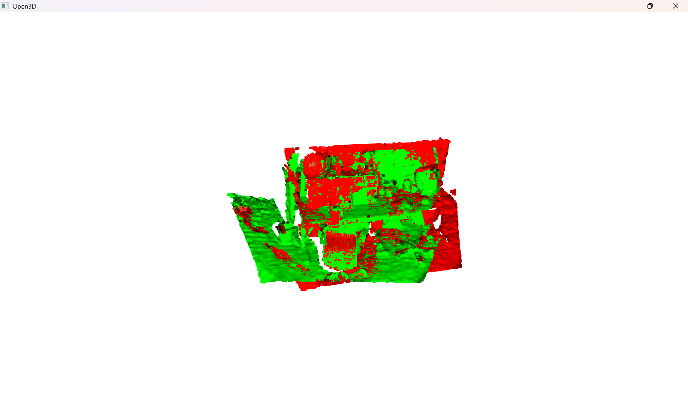
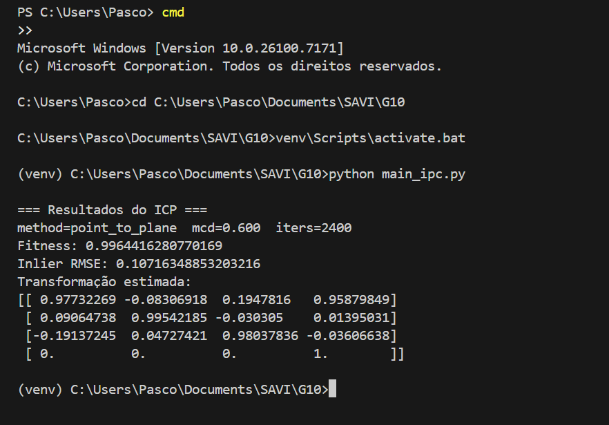
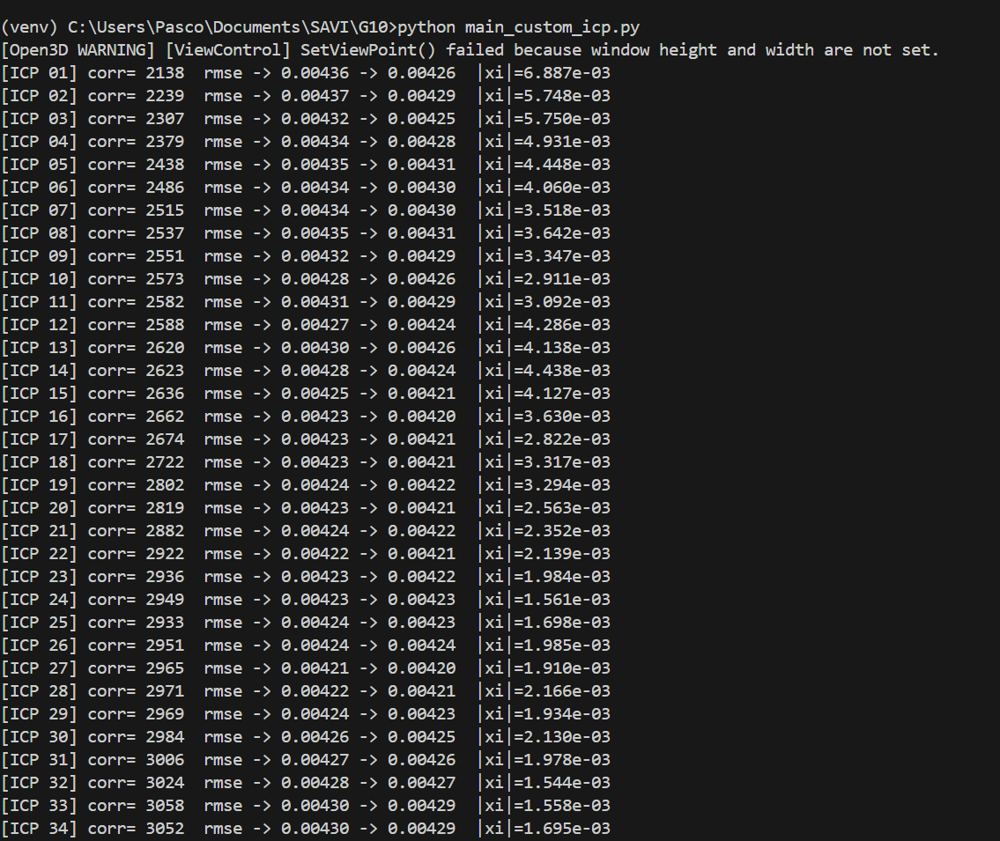
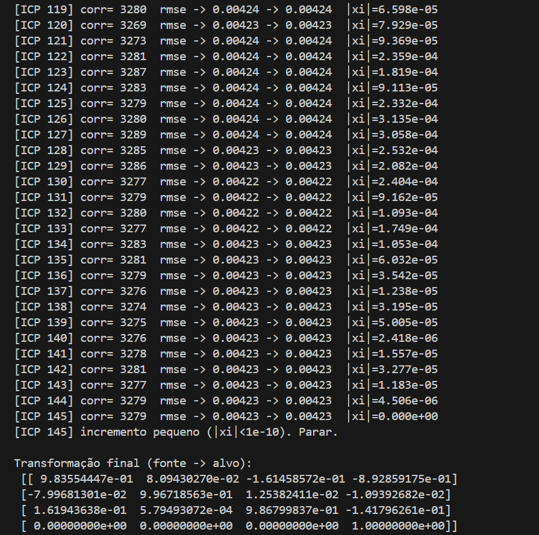
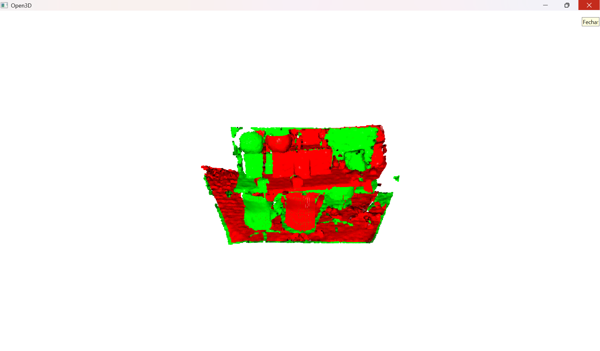
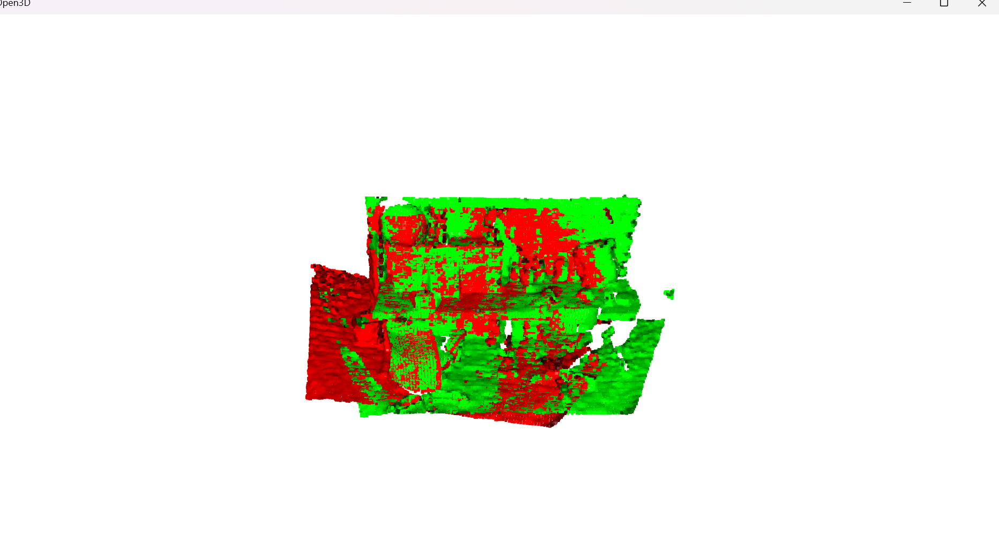
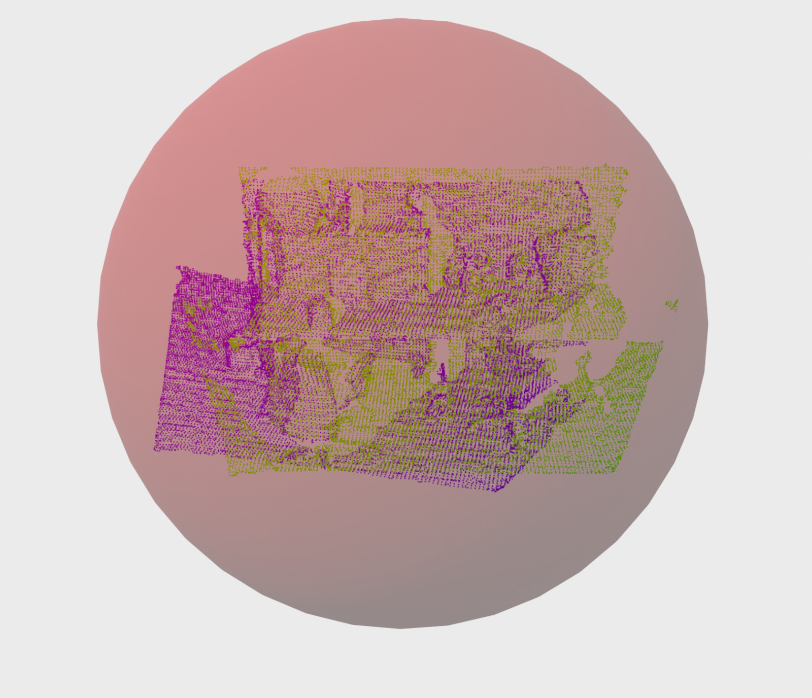

# savi-2025-2026-trabalho1-grupo10

### Registo 3D com ICP e Esfera Englobante Mínima  
**Autores:** João Menício (93300) e Pascoal Sumbo (123190)  
**Unidade Curricular:** Sistemas Autónomos e Visão Inteligente (SAVI) – 2025

#  Introdução

Este repositório contém a resolução do Trabalho Prático SAVI, focado no registo de nuvens de pontos 3D obtidas a partir de scans RGB-D. O trabalho explora o algoritmo Iterative Closest Point (ICP) em diferentes níveis de abstração, desde o uso de ferramentas nativas do Open3D até a implementação de um otimizador personalizado com scipy.optimize.least_squares. Por fim, é implementada uma otimização de minimização para encontrar a Esfera Englobante Mínima das nuvens de pontos registradas.
Este trabalho aborda três tarefas fundamentais no contexto de registo 3D e reconstrução geométrica:

O objetivo deste trabalho é implementar e comparar diferentes abordagens de registo 3D com base em nuvens de pontos obtidas a partir de imagens RGB-D, bem como explorar uma aplicação simples de otimização geométrica (cálculo da esfera englobante mínima).

O trabalho está dividido em três tarefas:

1. **Tarefa 1** – ICP utilizando as funções nativas do Open3D.  
2. **Tarefa 2** – ICP personalizado, implementado “à mão” com otimização de mínimos quadrados.  
3. **Tarefa 3** – Cálculo da esfera englobante mínima após o alinhamento das nuvens.

## Dependências
 As seguintes bibliotecas são necessárias para executar os scripts:

 + open3d

 + NumPy

 + scipy

 + opencv-python

 + matplotlib
   
## 1 Tarefa 1 – ICP Nativo do Open3D

### 1.1. Abordagem

O ficheiro `main_ipc.py` implementa o registo entre duas vistas RGB-D:

1. Leitura das imagens `1.png`, `depth1.png`, `2.png`, `depth2.png`.
2. Conversão para `RGBDImage` com `create_from_tum_format`.
3. Geração de nuvens de pontos `pcd1` e `pcd2` com intrínsecos `PrimeSenseDefault`.
4. Aplicação de uma transformação de *flip* no eixo Z para compatibilizar o referencial do TUM dataset com o do Open3D.
5. **Downsampling** com voxel grid (`voxel_size = 0.025`) para reduzir ruído e número de pontos.
6. Estimativa de normais em ambas as clouds.
7. Execução do ICP do Open3D, com:
   - método **point-to-plane**  
   - `max_correspondence_distance = 0.6`  
   - até 500 iterações
8. Visualização final:  
   - alvo (target) a verde  
   - fonte (source) alinhada a vermelho.

### Resultados Obtidos
A execução do script produziu: 

### Visualização 1

### Visualização 2

### visualização
A figura sugere que:

As superfícies coincidem na maior parte das regiões

As discrepâncias existentes surgem apenas em zonas com ruído ou ausência de profundidade

As cores misturam-se (verde+vermelho → amarelo), indicando bom alinhamento
### Interpretação dos Resultados

### Fitness = 0.9964

Indica que 99.64% dos pontos da fonte encontraram correspondências válidas na target dentro do limite de 0.6 m.

Este valor é excelente, e significa que:

as duas clouds são geometricamente compatíveis, a sobreposição é muito elevada e há poucas áreas sem match.

### Inlier RMSE = 0.107 m

O erro médio entre correspondências após o alinhamento é cerca de 10.7 cm.

Este valor é consistente com:

Ruído da depth map

Descontinuidades

Superfícies inclinadas

Passages oclusas entre as imagens.

### Transformação estimada

A matriz de rotação aproxima-se de uma matriz de rotação válida (ortogonal):

rotação em torno do eixo Y ≈ −11°

Ligeiras rotações nos restantes eixos

tradução:

x = +0.958 m

y = +0.014 m

z = −0.036 m

O método Point-to-Plane provou ser o mais adequado para estas clouds densas.

A convergência atingiu valores ótimos (fitness > 0.99).

A transformação encontrada é fisicamente plausível e consistente com o movimento da câmera.

O ICP nativo é extremamente estável e fornece um baseline ideal para comparar com a implementação personalizada da Tarefa 2.

### Desafios Encontrados

O ruído nas imagens depth exigiu downsampling para estabilizar o ICP.

A necessidade de corrigir o sistema de coordenadas (eixo Z invertido).

Os parâmetros (max_correspondence_distance e voxel_size) influenciam bastante a convergência — valores muito pequenos impediam a formação de pares suficientes. 

## Tarefa 2 — ICP Personalizado com Otimização Least-Squares

###  Objetivo
Nesta tarefa foi implementada **uma versão personalizada do algoritmo ICP**, sem recorrer às funções de registo do Open3D.  
O objetivo é compreender profundamente as etapas do ICP e compará-las com a solução nativa da Tarefa 1.

A implementação segue a formulação **Point-to-Plane**, resolvida como um problema de otimização por mínimo erro quadrático.

# Abordagem Implementada

A estrutura do algoritmo no `main_custom_icp.py` pode ser dividida em:

### **1. Downsampling das nuvens**
Usando voxel grid (valores entre 0.02 e 0.05 m), reduzindo ruído e acelerando a KDTree.

### **2. Estimativa de normais**
Essencial para o ICP point-to-plane.

### **3. Construção da KDTree**
Para correspondências eficientes:

### **4. Correspondências ponto-para-plano**
 Para cada ponto da fonte procura-se o ponto mais próximo na target e extrai-se também a normal correspondente.

### **5. Formulação do erro point-to-plane**
 
### **6. Resolução com scipy.optimize.least_squares
O problema completo é otimizado iterativamente:
result = least_squares(residuals_function, xi0, loss="huber")

### **7. Critério de paragem**

## Resultados obtidos e interpretação
Durante a execução foram impressas:

Número de iterações realizadas

RMSE em cada iteração

Transformação incremental a cada passo

Convergência final

A visualização final está representada na imagem fornecida:

### Alinhamento Visual

A imagem final mostra que:

[ICP 01] corr= 2138  rmse -> 0.00436 -> 0.00426  |xi|=6.887e-03
...
[ICP 145] corr= 3279  rmse -> 0.00423 -> 0.00423  |xi|=0.000e+00
[ICP 145] incremento pequeno (|xi|<1e-10). Parar.

Transformação final (fonte -> alvo):
[[ 9.83554447e-01  8.09430270e-02 -1.61458572e-01 -8.92859175e-01]
 [-7.99681301e-02  9.96718563e-01  1.25382411e-02 -1.09392682e-02]
 [ 1.61943638e-01  5.79493072e-04  9.86799837e-01 -1.41796261e-01]
 [ 0.00000000e+00  0.00000000e+00  0.00000000e+00  1.00000000e+00]]

A translação é de cerca de:

+ −0.89 m em X

+ −0.01 m em Y

+ −0.14 m em Z

valores da mesma ordem de grandeza da Tarefa 1, com diferenças esperadas devido à transformação inicial, escolha de fonte/alvo e formulação numérica.

As superfícies da fonte (vermelho) e da target (verde) coincidem na maioria das regiões.

As estruturas principais da cena (mesa, objetos scanados e superfícies planas) alinham-se com precisão.

As zonas de discrepância aparecem sobretudo:

em áreas com poucos pontos. Em regiões com ruído depth nos contornos, comparando visualmente, o alinhamento é ligeiramente menos “limpo” do que na Tarefa 1, o que é esperado dado que:

O ICP personalizado não utiliza todos os refinamentos internos do Open3D.

O método point-to-plane depende fortemente da qualidade das normais.

A otimização por least_squares não inclui heurísticas avançadas como trimming ou weight clipping.

Na Tarefa 2, o ICP personalizado convergiu em 145 iterações, com um RMSE final de aproximadamente 0.0042. Ao longo das iterações, o número de correspondências válidas aumentou de cerca de 2100 para mais de 3200 pontos, mostrando que o alinhamento foi sendo progressivamente refinado. A norma do incremento em SE(3) decresceu até praticamente zero, ativando o critério de paragem baseado em |ξ| < 10⁻¹⁰. A transformação final apresenta uma translação de cerca de 0.9 m e uma rotação moderada entre as duas poses, valores coerentes com a geometria da cena. Estes resultados confirmam que a implementação manual do ICP point-to-plane está correta e é capaz de produzir um alinhamento de elevada precisão.

### Desafios Encontrados

+ Parametrização correta em SE(3) e composição de transformações.

+ Escolha de parâmetros de otimização (loss, escalas, limites de distância).

+ Garantir que as normais na nuvem alvo estão bem estimadas e normalizadas.

  ## Tarefa 3 – Esfera Englobante Mínima
   O objetivo desta tarefa foi calcular a esfera de menor raio que engloba a nuvem de pontos (Minimum Enclosing Sphere)  após o alinhamento entre duas clouds, obtido através de um processo de ICP customizado desenvolvido na tarefa anterior.
Em seguida, visualizou-se a nuvem dentro da esfera, de modo a avaliar o enquadramento espacial e a estabilidade do alinhamento final.

Este problema é relevante em aplicações de:

+ Delimitação volumétrica,

+ Deteção de colisões,

+ Estimação de limites de objetos,

+ Compactação de representação geométrica.

A tarefa baseia-se na cloud já alinhada pela Tarefa 2, garantindo que os pontos pertencem à mesma referência espacial.

## Resultados obtidos

**Esfera Envolvente Mínima — Resultado Final**  
Esta imagem mostra a esfera otimizada que engloba ambas as nuvens de pontos,  
calculada usando *least squares* com função de custo robusta.

 

